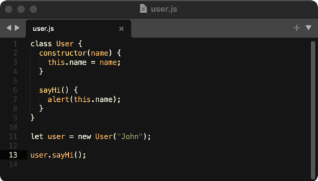

# Boron

### Sublime Text Color Scheme

Colorful, dark color scheme based on the excellent Jellybeans color scheme for Vim.

## Installation

Copy the `Boron.tmTheme` file to your local `Sublime Text/Packages/User` directory.

Now you can select `Boron` in the Sublime Text Preferences.
